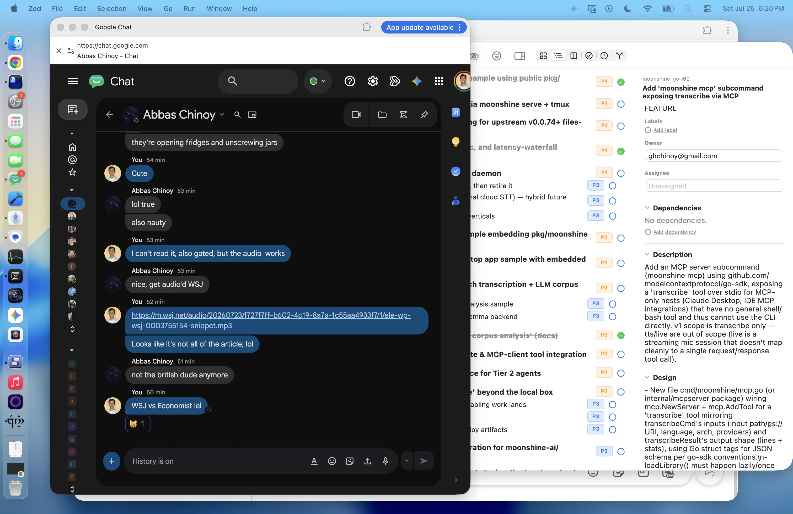

# Eldamo App

A cross-platform desktop dictionary and semantic concept search engine for J.R.R. Tolkien's constructed Elvish languages and Mannish tongues.



> *Credit: README structure based on Mark Allen's ["How to Write a Great README for Your Public GitHub Project"](https://www.markcallen.com/how-to-write-a-great-readme-for-your-public-github-project/).*

---

## Table of Contents

- [Quick Start & Installation](#quick-start--installation)
- [Key Features](#key-features)
- [Search & Transliteration Examples](#search--transliteration-examples)
- [Documentation](#documentation)
- [Contributing](#contributing)
- [Credits & License](#credits--license)

---

## Quick Start & Installation

### Option 1: Download Desktop Binary (Recommended)

Download the latest pre-compiled release for **macOS** or **Linux** from [GitHub Releases](https://github.com/ghchinoy/eldamo-app/releases/latest).

```bash
# macOS: Extract and launch Eldamo App
unzip Eldamo-macOS.zip
open Eldamo.app

# Linux: Extract and run
tar -xzvf Eldamo-Linux.tar.gz
./Eldamo
```

*On first launch, open **Settings** (`⌘,`) to download the prebuilt 768-dimensional vector database (`eldamo-db.zip`, ~113MB).*

---

### Option 2: Build From Source

```bash
# 1. Clone repository
git clone https://github.com/ghchinoy/eldamo-app.git
cd eldamo-app

# 2. Install dependencies & build FTS database
npm install --prefix frontend
make build-db-fts

# 3. Launch application in dev mode
make dev
```

*(See the [Developer Guide](docs/DEVELOPER_GUIDE.md) for full prerequisite versions and build pipeline details).*

---

## Key Features

- **35,900+ Lexicon Entries**: Complete coverage of Quenya, Sindarin, Primitive Elvish, Adûnaic, Westron, Khuzdul, and 42 other Tolkien language varieties.
- **Hybrid Search Engine**: Lightning-fast exact keyword search (SQLite FTS5 BM25) and semantic concept search using Gemini Embedding 2 (768-dim L2-normalized vectors).
- **Glaemscribe Tengwar Engine**: Live Elvish script transliteration rendered on search cards, detail views, and a dedicated **Tengwar Transliterator** tool with bundled Annatar, Eldamar, and Parmaite web fonts.
- **Side-by-Side Etymology Panel**: Persistent right-rail inspector displaying headword details, parent root derivations, cross-language cognates, child words, and manuscript attestations (`PE17`, `Let`, `WJ`).
- **Lexicon Assistant**: RAG-grounded AI chat interface to ask natural-language questions about Elvish grammar, etymologies, and word roots with interactive citation chips.
- **Material 3 Neutral Blue Theme**: Clean light/dark modes with system auto-adaptation and offline local Shoelace UI components.

---

## Search & Transliteration Examples

### Full-Text & Concept Search
- `star` / `elen` / `calë` → Exact keyword lookups across forms and English glosses.
- *"words related to radiance or morning light"* → Semantic concept query retrieving `calë` (light), `glær` (gleam), `galad` (radiance), and `anar` (sun).

### Live Tengwar Transliteration
| Language | Input Phrase | Mode | Output |
|---|---|---|---|
| **Quenya** | `namárië` | Quenya Classical | `5#t~C7T`V` |
| **Sindarin** | `A Elbereth` | Sindarin General Use | ` ` |
| **Black Speech** | `ash nazg durbatulûk` | Black Speech | ` 5 7` |

---

## Documentation

Comprehensive documentation is available in the `docs/` directory:

| Guide | Description |
|---|---|
| 📖 **[User Guide](docs/USER_GUIDE.md)** | Complete walkthrough of search modes, language taxonomy, Right Rail etymology inspection, Tengwar tools, and settings. |
| 🛠️ **[Developer Guide](docs/DEVELOPER_GUIDE.md)** | Architecture overview, Lit Web Component hierarchy, Makefile commands, Vertex AI ADC database generation, and release workflows. |

---

## Contributing

Contributions are welcome! Whether fixing bugs, adding linguistic dataset features, or refining UI components:

1. Read the **[Developer Guide](docs/DEVELOPER_GUIDE.md)** for setup and architecture details.
2. Check open tasks in `bd ready` (`bd` issue tracker) before starting major work.
3. Ensure `make check` passes cleanly before opening a pull request.

---

## Credits & License

- **Eldamo Dataset**: Compiled and maintained by **Paul Strack** at [Eldamo.org](https://eldamo.org).
- **Glaemscribe Engine**: Created by **Benjamin Babut** ([Talagan](https://github.com/BenTalagan/glaemscribe)) under the AGPLv3 license.
- **Code License**: Eldamo App source code is licensed under the **[MIT License](LICENSE)**.
