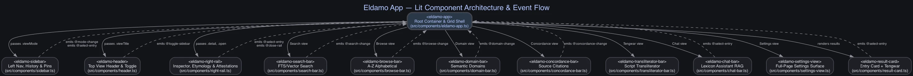

# Eldamo App — Developer & Contributor Guide

Welcome to the developer documentation for **Eldamo App**, a cross-platform desktop lexicon viewer and multilingual vector search engine for J.R.R. Tolkien's constructed languages.

---

## Table of Contents

1. [Architecture & Data Pipeline](#1-architecture--data-pipeline)
2. [Component Architecture & Event Flow](#2-component-architecture--event-flow)
3. [Development Setup](#3-development-setup)
4. [Database Pipeline & Makefile Commands](#4-database-pipeline--makefile-commands)
5. [Release & Packaging Process](#5-release--packaging-process)
6. [Issue Tracking & Contribution Workflow](#6-issue-tracking--contribution-workflow)

---

## 1. Architecture & Data Pipeline

```
                   ┌──────────────────────────────────────────────┐
                   │ eldamo-data.xml (35,900 words, 30MB)         │
                   └──────────────────────┬───────────────────────┘
                                          │
                        go run ./cmd/builder (-vectors)
                                          │
                                          ▼
                   ┌──────────────────────────────────────────────┐
                   │ dist/eldamo.db (SQLite + FTS5 + sqlite-vec)  │
                   └──────────────────────┬───────────────────────┘
                                          │
                   ┌──────────────────────┴───────────────────────┐
                   │             Wails v2 (Go) Backend            │
                   │  mattn/go-sqlite3 + sqlite-vec CGO bindings  │
                   └──────────────────────┬───────────────────────┘
                                          │ IPC (Go struct bindings)
                   ┌──────────────────────┴───────────────────────┐
                   │           Vite + Lit Web Components          │
                   │  Material 3 Neutral Blue Theme + Glaemscribe │
                   └──────────────────────────────────────────────┘
```

The database co-locates structured dictionary records, an FTS5 full-text index, and `sqlite-vec` `vec0` virtual tables inside a single portable SQLite file (`eldamo.db`).

The application backend uses **Wails v2** (specifically v2.13.0) to bind Go methods to TypeScript frontend handlers.

---

## 2. Component Architecture & Event Flow

Eldamo App uses Lit Web Components arranged in a responsive CSS Grid shell (`264px sidebar | 1fr main workspace | 360px right rail`).



*(Graphviz source available in [`docs/component_hierarchy.dot`](component_hierarchy.dot))*

### Key Lit Components:
- **`<eldamo-app>`**: Root container and view mode manager (`src/components/eldamo-app.ts`).
- **`<eldamo-sidebar>`**: Navigation, recent/pinned entry history, theme & settings anchors (`src/components/sidebar.ts`).
- **`<eldamo-header>`**: Slim topbar displaying current view title and sidebar toggle button (`src/components/header.ts`).
- **`<eldamo-search-bar>`**: FTS vs Vector search mode toggle, query input, and language filter (`src/components/search-bar.ts`).
- **`<eldamo-browse-bar>`**: Paginated A–Z letter selector strip and language filter (`src/components/browse-bar.ts`).
- **`<eldamo-domain-bar>`**: Semantic domain group and category picker (`src/components/domain-bar.ts`).
- **`<eldamo-concordance-bar>`**: Bibliographic source citation selector and root stem input (`src/components/concordance-bar.ts`).
- **`<eldamo-transliterator-bar>`**: Glaemscribe Tengwar transliteration tool view (`src/components/transliterator-bar.ts`).
- **`<eldamo-chat-bar>`**: RAG-grounded Lexicon Assistant Q&A interface (`src/components/chat-bar.ts`).
- **`<eldamo-settings-view>`**: Full-page Settings surface for Appearance, Database management, and Gemini API Key (`src/components/settings-view.ts`).
- **`<eldamo-right-rail>`**: Side-by-side inspector panel for word details, Tengwar, etymological derivations, cognates, children, and attestations (`src/components/right-rail.ts`).
- **`<eldamo-result-card>`**: Dictionary entry card rendering live Tengwar transliterated headwords (`src/components/result-card.ts`).

---

## 3. Development Setup

### Prerequisites

- **Go toolchain** (1.22+): `go version`
- **Wails v2 CLI** (`v2.13.0`): `go install github.com/wailsapp/wails/v2/cmd/wails@v2.13.0`
- **Node.js** (v18+ or v20+): `node --version`

### Quickstart

```bash
# 1. Clone repository
git clone https://github.com/ghchinoy/eldamo-app.git
cd eldamo-app

# 2. Install frontend dependencies
npm install --prefix frontend

# 3. Fetch XML dataset & build FTS database
make build-db-fts

# 4. Verify compilation & type-checking
make check

# 5. Launch application in Wails dev mode
make dev
```

---

## 4. Database Pipeline & Makefile Commands

The build system supports custom XML dataset locations via the `ELDAMO_XML_PATH` environment variable and two embedding generation modes (Gemini API Key vs Google Cloud Vertex AI ADC).

```bash
# Download XML from upstream pfstrack/eldamo repository (defaults to data/eldamo-data.xml)
make fetch-xml

# Build structured + FTS5 database (fast, offline, no API key required)
make build-db-fts

# Build full 768-dim vector database using Gemini Developer API Key
export GEMINI_API_KEY="your-api-key"
make build-db

# Build full 768-dim vector database using Google Cloud Vertex AI (ADC authentication)
make build-db-vertex

# Run search quality benchmark suite (MRR, Recall@5, Recall@10)
make eval

# Compile production Wails desktop application bundle
make build-app
```

---

## 5. Release & Packaging Process

Releases are automated via GitHub Actions (`.github/workflows/release.yml`).

### How to Release a New Version

1. Update the version constant in `internal/app/app.go` (`const AppVersion = "0.x.x"`) and `wails.json`.
2. Ensure all quality checks pass: `make check`.
3. Commit changes and push a semantic version tag:
   ```bash
   git tag v0.x.x
   git push origin v0.x.x
   ```
4. GitHub Actions automatically compiles native binaries on `macos-latest` (`Eldamo-macOS.zip`) and `ubuntu-latest` (`Eldamo-Linux.tar.gz`) and attaches them to the Release.
5. If the database schema or embeddings updated, build the compressed database package (`zip -j eldamo-db.zip dist/eldamo.db`) and upload it to the GitHub Release via `gh release upload v0.x.x eldamo-db.zip`.

---

## 6. Issue Tracking & Contribution Workflow

This project uses **`bd` (beads)** for issue tracking and task management.

```bash
# Check unblocked ready work
bd ready

# Claim a task
bd update <id> --claim

# Complete work
bd close <id> --reason "Completed"
```

Please run `make check` before submitting pull requests.
